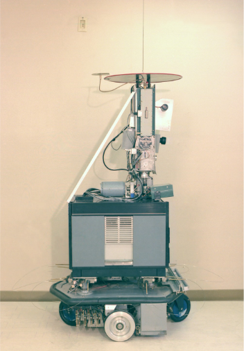
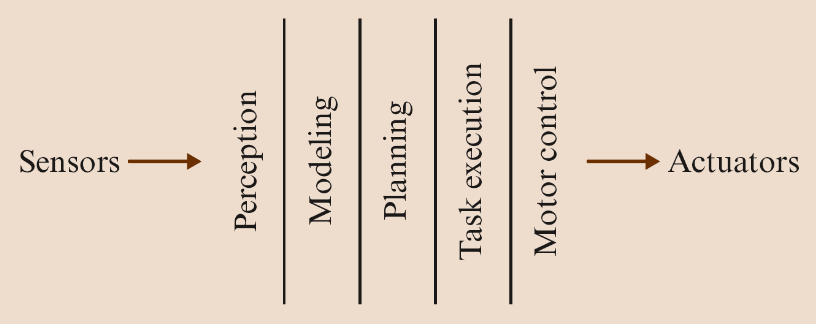
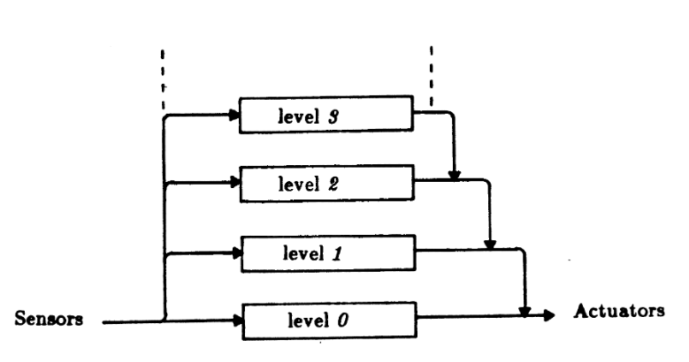
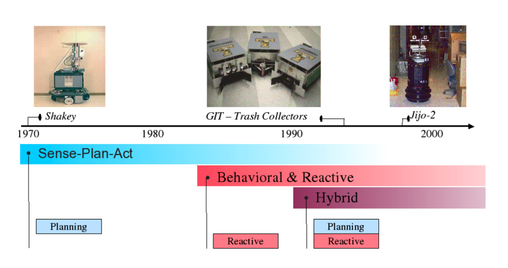

# Рассуждения на тему архитектур систем управления роботами

## Введение

Чтобы реализовать решение командной задачи, вам нужно будет подумать о том, как разделить и структурировать программу, управляющую вашим роботом.
В рамках подготовки к этому в сегодняшней лекции мы рассмотрим, как люди уже подходили к этой проблеме. 
Другими словами, мы рассмотрим историю архитектуры роботов

Что такое архитектура роботов?

Термин "архитектура роботов" используется для обозначения того, как система делится на подсистемы и как эти подсистемы взаимодействуют.
Архитектура роботов отличается от других архитектур программного обеспечения особыми потребностями роботизированных систем.

## Иерархическая архитектура

Каковы особые требования к роботизированным системам?

Роботизированные системы работают в сложных динамичных средах реального времени.
Эти системы должны:
- управлять различными датчиками и исполнительными механизмами в режиме реального времени,
- в условиях значительной неопределенности и шума, отслеживая неожиданные ситуации и реагируя на них,
- и делать все это одновременно и асинхронно.

Кроме того, роботизированные системы должны реагировать в различных временных рамках - от миллисекундного управления с обратной связью до минут или часов., для решения сложных задач.

Разработка архитектуры и программирования роботов началась в конце 1960-х годов с создания робота Shakey в Стэнфордском университете.

На рисунке: робот Shakey. У Shakey была камера, дальномер и датчики ударов, и он был подключен к компьютерам DEC PDP-1O и PDP-I5 по радио- и видеосвязи.

Архитектура Shakey была разделена на три функциональных элемента: распознавание, планирование и выполнение.
1. Система распознавания преобразовала изображение с камеры в модель внутреннего мира.
2. Планировщик взял модель внутреннего мира и цель и сгенерировал план (т.е. последовательность действий), которые позволят достичь цели.
3. Исполнитель взял план и отправил действия роботу.

Этот подход получил название парадигмы "смысл-план-действие" (SPA).

Рисунок: Парадигма "смысл-план-действие".

Компоненты робота в этом случае, как говорят, организованы горизонтально. Информация из окружающего мира в виде сенсорных данных должна пройти несколько промежуточных этапов интерпретации, прежде чем, наконец, стать доступной для ответа.

Основные архитектурные особенности СПА-парадигмы заключаются в том, что датчики перетекли в модель мира, которая затем была использована проектировщиком, и этот план был выполнен без непосредственного использования датчиков, создавших модель.

В этих ранних системах основное внимание уделялось созданию подробной модели мира, а затем тщательному планированию дальнейших шагов.

Проблема заключалась в том, что, пока робот создавал свою модель и размышлял о том, что делать дальше, мир, скорее всего, менялся.

Таким образом, эти роботы демонстрировали странное поведение: они смотрели (собирали данные, часто в виде одного или нескольких снимков с камеры), обрабатывали и планировали, а затем (часто после значительной задержки) приступали к действию на пару шагов, прежде чем начать цикл сначала (смотрели и поведение при крене).

Проблемы с планированием SPA

1. в любой области реального мира требовали много времени, и робот был бы заблокирован в ожидании завершения планирования.
2. Выполнение плана без использования датчиков было опасным в динамичном мире.

Часто система SPA разрабатывает план, но прежде чем этот план может быть выполнен в полном объеме, он становится недействительным из-за изменений в реальном мире.

## Реактивная архитектура

В 1986 году Родни А. Брукс опубликовал статью, в которой описывался тип реактивной архитектуры, называемый архитектурой подчинения

[//]:()
Реализация

Архитектура подсистемы построена на основе уровней взаимодействующих конечных автоматов, каждый из которых напрямую соединяет датчики с исполнительными механизмами.

Эти конечные автоматы назывались behaviors (что привело к тому, что некоторые назвали архитектуру subsumption behavior-based или поведенческой робототехникой).

Поскольку в любой момент времени могло быть задействовано несколько моделей поведения, у Subsumption был механизм арбитража, который позволял моделям поведения более высокого уровня переопределять сигналы с более низкого уровня поведения.

[//]:()

Архитектура подчинения стала доминирующим подходом в архитектурах реактивных роботов.

Рисунок: Архитектура подчинения

Архитектура подчинения (Brooks, 1986) характеризовалась:
1. отсутствие представления о внешнем мире,
2. анализ архитектуры на основе задачи, а не на функциональной основе,
3. отнесение поведения к поведению более высокого уровня,
4. плотная связь между датчиками и исполнительными механизмами.

Например, поведение робота может заключаться в том, что он просто управляет роботом в произвольных направлениях. Это поведение всегда активно, и робот всегда куда-то направляется.

Поведение второго, более высокого уровня может принимать сигналы датчиков, обнаруживать препятствия и уводить робота от них. Он также всегда активен.

В среде, где нет препятствий, поведение более высокого уровня никогда не генерирует сигнал. Однако, если он обнаруживает препятствие, он переопределяет поведение более низкого уровня и уводит робота в сторону.

Как только препятствие исчезнет (и более высокий уровень поведение перестает посылать сигналы), поведение на более низком уровне снова получает контроль.
Для создания все более сложных роботов можно создать множество взаимодействующих уровней поведения.

## Сравнение архитектуры подчинения и SPA

Масштабируемость: Брукс утверждал, что там, где архитектура SPA должна быть существенно переработана, чтобы обеспечить включение новых возможностей в роботизированную систему, включение Архитектура позволяла добавлять новые возможности, просто добавляя в систему новые уровни поведения, которые могли переопределять или включать в себя поведение более низких уровней там, где это необходимо, без необходимости вмешиваться или перепроектировать поведение более низких уровней.

Производительность: В то время как SPA-роботы были медленными и громоздкими, роботы-уборщики были быстрыми и реактивными. Динамичный мир их не беспокоил, потому что они
постоянно ощущал окружающий мир и реагировал на него.

## Проблемы с реактивным (поведенческим) подходом

Однако роботы, основанные на поведении, вскоре достигли предела своих
возможностей.

1. Это оказалось очень трудно составить поведения для достижения долгосрочные цели
2. Оказалось, что оптимизировать поведение робота практически невозможно.

По сути, роботам требовались возможности планирования ранних архитектур, связанные с реактивностью архитектур, основанных на поведении. Осознание этого привело к разработке многоуровневых архитектур управления роботами.

Эти гибридные архитектуры могут характеризоваться распределением возможностей по уровням, где уровни низкого уровня обеспечивают реактивные возможности, а уровни высокого уровня обеспечивают более интенсивные с точки зрения вычислений совещательные возможности.

Наиболее популярным вариантом этих гибридных архитектур являются трехуровневые архитектуры:

1. Контроллер или Реактивный уровень
2. Секвенсор или Исполнительный уровень
3. Планировщик или Совещательный уровень

### Контроллер (реактивный уровень)

Уровень контроллера (он же реактивный) обеспечивает низкоуровневое управление роботом.
Для него характерна тесная взаимосвязь между датчиками.
Цикл принятия решения часто составляет порядка миллисекунд.
С точки зрения разработки программного обеспечения контроллер представлял бы собой набор драйверов с базовыми реакциями, в то время как с биологической точки зрения контроллер - это набор нервных связей с мышцами и другими органами.
Управляющие элементы должны обладать низкой вычислительной сложностью, чтобы они могли быстро реагировать на раздражители и быстро выполнять основные действия.

### Секвенсор (исполнительный уровень)

Уровень секвенсора (он же исполнительный) находится между уровнем контроллера низкого уровня и уровнем планировщика более высокого уровня.
Он принимает директивы от уровня планировщика и упорядочивает их для реактивного уровня.
Естественно, это упорядочение не может быть простым линейным списком, поскольку среда, в которой выполняется управление, может неожиданно измениться, и примитивное поведение контроллера может привести к сбою.
Например, исполнительный уровень может обрабатывать набор промежуточных точек, сгенерированных планировщиком совещательного пути, и принимать решения о том, какое реактивное поведение следует активировать.

Уровень секвенсора также отвечает за интеграцию информации с датчиков во внутреннее представление состояния. Например, на нем могут размещаться процедуры локализации роботов и картографирования. Циклы принятия решений на исполнительном уровне обычно занимают порядка секунды.

### Планировщик (совещательный уровень)

Планировщик, или совещательный уровень, содержит наиболее сложные вычислительные компоненты, традиционно содержащие средство поиска в пространстве состояний с экспоненциальным или высокополиномиальным распределением.
Планировщик генерирует глобальные решения для сложных задач.
Цикл принятия решений в нем часто составляет несколько минут.
Для принятия решений планировщик использует модели.
Эти модели обычно используют информацию о состоянии, собранную на исполнительном уровне.

## Обзор архитектур управления роботами

Рисунок: Временная шкала архитектур управления роботами.

Sense, Plan, Act - это ранняя процедура управления роботами, которую обычно сокращенно называли SPA.
Сегодня мы используем его фундаментальные концепции, чтобы напомнить нам о трех важнейших свойствах, которыми должен обладать каждый робот для эффективной работы:

- ЧУТЬЕ: Робот должен уметь распознавать важные моменты в окружающей среде, такие как наличие препятствий или навигационных средств.
- ПЛАНИРУЙТЕ: Робот должен получить полученные данные и выяснить, как правильно на них реагировать, основываясь на уже существующей стратегии.
- ДЕЙСТВИЕ: Наконец, робот должен действительно действовать, чтобы выполнить действия, предусмотренные планом.

## Пример с кодом

## Заключение

Сегодняшняя лекция посвящена тому, что существуют различные способы структурирования вашей контрольной программы и что важно привести структуру вашей программы в соответствие с требуемой задачей.
Это изучение того, как структурировать свои программы в соответствии с требуемой задачей, - это то, что вы будете изучать в области разработки программного обеспечения.
Что касается командного проекта, то я хочу, чтобы вы вынесли из сегодняшней лекции то, что часто бывает быстрее потратить некоторое время на разработку структуры в начале проекта. вашей программы, а не сразу погружаться в кодирование.
